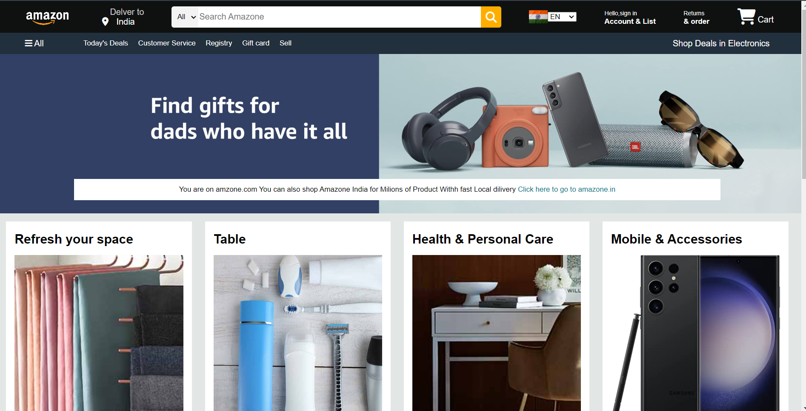
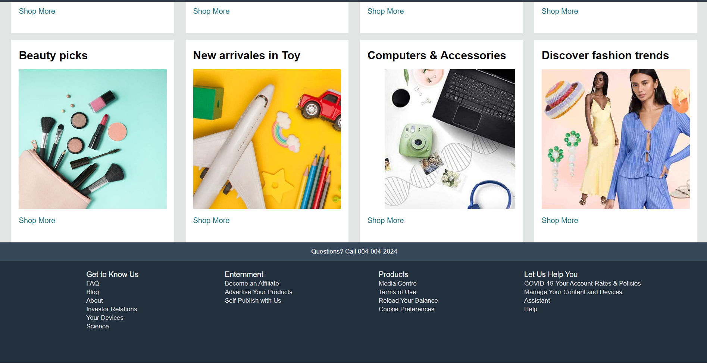
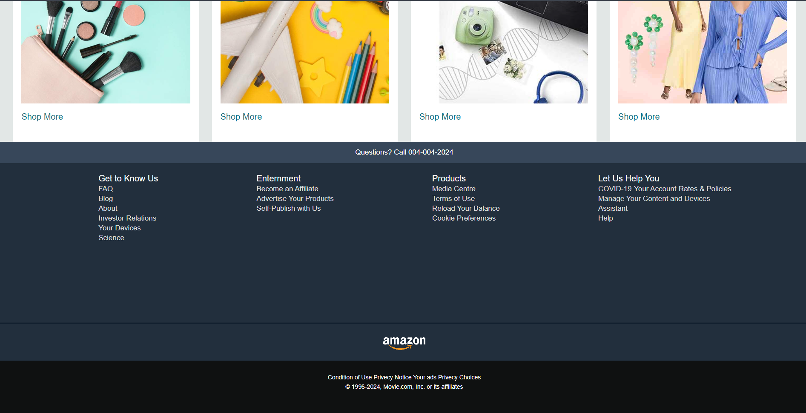

## Amazon Clone (HTML & CSS)

This project is a simple, static clone of the Amazon e-commerce platform, built using only HTML and CSS. It showcases the visual design and layout of an online shopping website, replicating the look and feel of Amazon's homepage and product pages.

## Tech Used

- HTML: Structure of the web pages.
- CSS: Styling and layout.

## Key Features
> Responsive Design: The layout adapts to different screen sizes for mobile, tablet, and desktop views.
> Product Listings: Static product cards displaying product images, names, and prices.
> Navigation Bar: Includes categories, search bar, and account links similar to Amazon.
> Footer Section: Information and links typically found on e-commerce websites.
## Project Structure
> index.html: Main homepage structure.
> styles.css: CSS file for all styling, including layout, fonts, and responsiveness.
> Pic/: Contains images and icons used in the project.
## Installation and Setup
Clone the repository:
bash
Copy code
git clone https://github.com/your-username/amazon-clone-html-css.git
Open the index.html file in your browser to view the project.

##  Future Enhancements
> Add interactivity using JavaScript (e.g., search functionality, cart).
> Expand to multiple pages like product details, checkout, etc.
> Implement animations and transitions for a more dynamic user experience.

## Contributing
Contributions are welcome! Feel free to fork the repository and submit pull requests for review.

## License
This project is licensed under the MIT License - see the LICENSE file for details.

### Expected Output

Ss